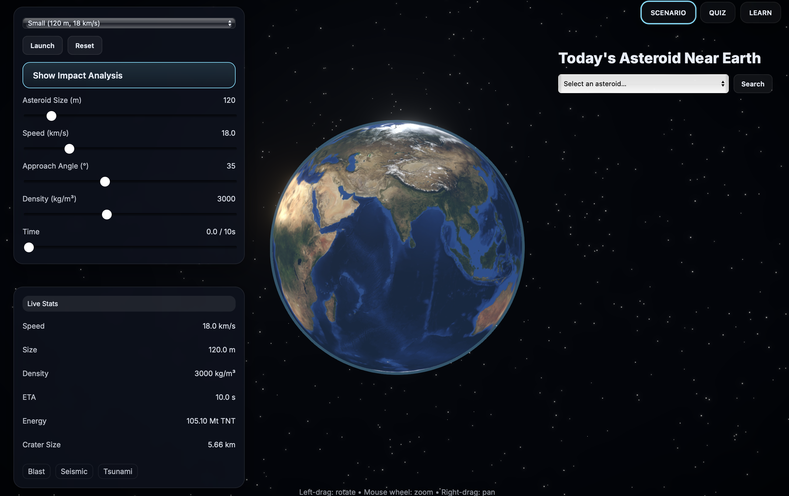

# Meteor Madness

An interactive 3D visualization and simulation application built with React Three Fiber for exploring meteor and asteroid data.


<div align="center">
  
</div>


## ✨ Features

- **3D Visualization**: Immersive 3D rendering using Three.js and React Three Fiber
- **Interactive Mapping**: Real-time geographic visualization with Leaflet
- **State Management**: Efficient state handling with Zustand
- **Backend API**: Express server for data processing and API endpoints

### Prerequisites

Make sure you have Node.js and npm installed on your system:

```bash
node -v
npm -v
```

### Installation

1. **Clone the repository**
```bash
git clone https://github.com/isaak1294/meteor-madness.git
cd meteor-madness
```

2. **Install frontend dependencies**
```bash
npm install three @react-three/fiber @react-three/drei zustand
npm install leaflet react-leaflet@4 @types/leaflet
npm install -D @vitejs/plugin-react
```

3. **Install backend dependencies**
```bash
npm install express cors
npm install -D typescript ts-node nodemon @types/node @types/express
```

### Running the Application

**Frontend:**
```bash
npm run dev
```

**Backend:**
```bash
# Instructions for running the backend server
# Add your specific backend start command here
```

## Tech Stack

### Frontend
- **React** - UI framework
- **Three.js** - 3D graphics library
- **React Three Fiber** - React renderer for Three.js
- **React Three Drei** - Helper components for React Three Fiber
- **Leaflet** - Interactive mapping library
- **React Leaflet** - React components for Leaflet
- **Zustand** - State management
- **Vite** - Build tool and development server

### Backend
- **Express** - Web application framework
- **TypeScript** - Type-safe JavaScript
- **CORS** - Cross-origin resource sharing
- **Nodemon** - Development auto-reload

## 📁 Project Structure

```
meteor-madness/
├── src/
│   ├── components/     # React components
│   ├── scenes/         # Three.js scenes
│   └── ...
├── backend/            # Express server
└── package.json
```
